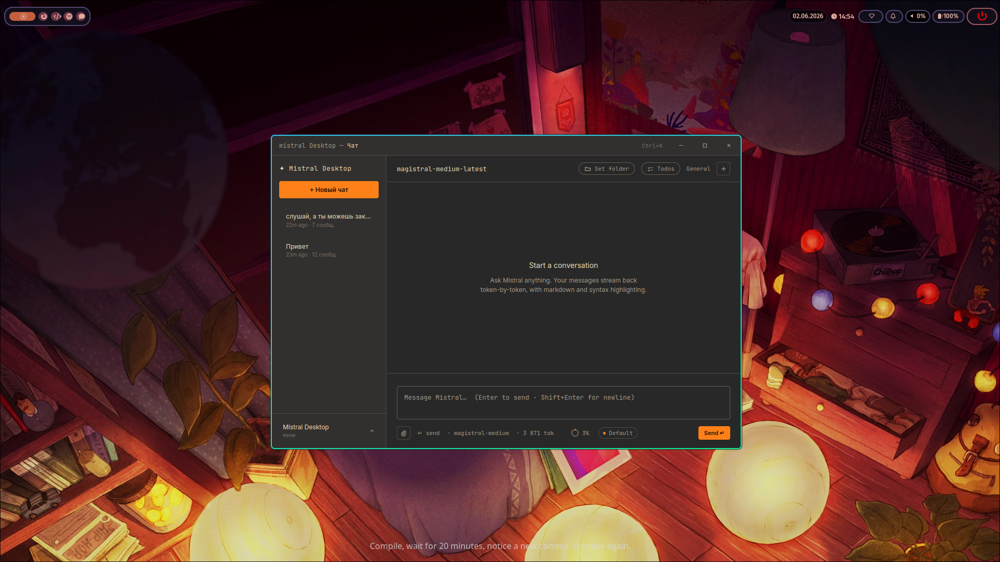

<div align="center">

# Mistral Desktop Client

A desktop client for Mistral AI built with Electron and plain JavaScript. Streaming chat, history, system prompts and an agent that works with your files through tools.



</div>

---

## Navigation

- [About](#about)
- [Install](#install)
- [How agents work](#how-agents-work)
- [How tools work](#how-tools-work)
- [Contacts](#contacts)

---

## About

A desktop app for talking to Mistral models. No third-party services: Mistral only. Your key is stored locally through `safeStorage` and never leaves your machine except for the official API.

**Chat** Responses arrive over SSE and render token by token with a live cursor. GitHub-flavored markdown, syntax highlighting and copy buttons in code blocks. Auto-scroll is smart: it pauses the moment you scroll up. You can abort generation at any point, and token usage is counted right next to it.

**Settings** Two columns: API, model, output, interface, shortcuts. Custom sliders for temperature and top-p, a connection test with latency, Dark / OLED / Dim themes and font size - everything applies instantly, no restart.

**History** A dense table of saved sessions with search, row selection, bulk export and delete. Any session can be opened or exported to `.md` or `.json`.

**System prompt** An editor with a monospace font, line numbers and a character and token counter. Comes with presets: General, Code Assistant, Translator, Analyst.

**Command palette** (`Ctrl+K`) and keyboard shortcuts throughout the app.

### Stack

```
src/
├── main/
│   ├── main.js      Electron main: frameless window, window state persistence,
│   │                IPC for electron-store, safeStorage key, export
│   ├── preload.js   Context bridge - the single IPC surface (contextIsolation)
│   ├── mistral.js   Mistral API service: native fetch, SSE streaming, abort
│   ├── agent.js     Agent loop: tool calls, permission gates,
│   │                planning/approval, isolated subagents
│   ├── tools.js     Tool registry - schema, permissions and impl in one table
│   ├── consoles.js  Persistent shell sessions (state lives across commands)
│   ├── skills.js    Skills: discovery, parsing and rendering of Markdown playbooks
│   └── skills/      Built-in skills (debug · review · simplify · analyze · …)
└── renderer/
    ├── index.html   App shell (titlebar + navigation + content)
    ├── app.js       Page router, shortcuts, command palette
    ├── shared.js    Store helpers, toasts, modals, markdown rendering
    ├── models.js    Model catalogue and their capabilities
    ├── pages/       chat · settings · history · system-prompt · about
    ├── styles/      base · layout · components (CSS variables)
    └── vendor/      bundled marked + highlight.js (built with esbuild)
```

Security: `contextIsolation: true`, `nodeIntegration: false`, a strict CSP. All access to Node and the API goes through namespaced IPC channels (`store:*`, `apikey:*`, `mistral:*`, `window:*`, `session:*`).

---

## Install

Grab a ready build from the releases page:
#### [Latest release](https://github.com/Thonny-Developer/mist-desktop/releases/latest)

It ships an installer and a portable version. After launch, open **Settings**, pick **API**, paste your Mistral key and hit **Test connection**

### Build from source

```bash
npm install        # download dependencies
npm start          # run
npm run dev        # run with DevTools
```

Build distributables:

```bash
# NSIS installer + portable .exe in dist/
npm run dist:win

# Linux build
npm run dist:linux
```

On Windows you can drop a `build/icon.ico` in first (see `build/README.md`)

---

## How agents work

The agent isn't a separate command, it's a mode the chat runs in. The model gets a tool catalogue in its context and works in a loop: it thinks, calls a tool, sees the result, decides what to do next. This keeps going until it produces a final answer

A single pass looks like this:

1. You write a task in the chat
2. The model replies with plain text and/or calls a tool through an `<action>` block
3. The call is parsed and executed in the main process
4. The result comes back to the model as a new message
5. The loop repeats - up to 10 tool steps per request

The model expresses an action like this:

```
<action>{"tool":"write_file","path":"src/app.js","content":"…"}</action>
```

Everything the agent does is visible right in the chat: which tool was called, with what arguments and what it returned. The selected working folder and a `todos N/M` chip live in the chat header

### Permissions and approvals

Every tool carries a permission label (`readOnly`, `mutating`, `destructive`, `shell`, `web`). In the default mode, mutating and destructive actions need confirmation, while reads go through freely. The agent can show a plan first and wait for approval before changing anything

### Skills

A skill is a reusable Markdown playbook with a YAML header (`name`, `description`, `allowed-tools`, `argument-hint`). Skills are discovered across three layers: built-in → `<userData>/skills` → `<workingDir>/.mist/skills`, where a later layer overrides an earlier one

You can run a skill with a slash command in the chat (`/review src`), or the model picks one itself through `run_skill` / `list_skills`. `$ARGUMENTS` and `$1…$9` are substituted into the body, and a skill can restrict the available tools through its `allowed-tools`. Manage them in **Settings**, under **Skills**

```markdown
---
name: review
description: Review recent changes for bugs and improvements
allowed-tools: read_file, list_files, exec_bash
argument-hint: [path or focus]
---
You are a senior reviewer. Review $ARGUMENTS …
```

### Subagents

Through the `run_subagent` tool, the agent delegates a subtask to an isolated worker. It gets its own context and a trimmed, mostly read-only set of tools. The subagent runs on its own without asking the user, is limited by nesting depth, and returns a single text report that becomes the tool result for the parent. Its work shows up in the chat too - indented under the main lines

---

## How tools work

Every tool is declared in one table - the `tools.js` registry. Each tool is described there exactly once: the schema the model calls it with, the permission metadata, and the implementation

Everything is derived from this table: the schemas sent to the model, the permission gates in the agent loop, the discovery list, and the read-only subset a subagent is allowed. So a tool can't drift between how it's registered, described and gated

### Available tools:
> The tool list is updated often

| Tool | What it does |
|---|---|
| `set_working_folder` | Pick a working folder - the sandbox for file operations |
| `list_files` | Show folder contents |
| `read_file` | Read a file |
| `write_file` | Write or create a file |
| `delete_file` | Delete a file |
| `add_todo` | Add a task to the list |
| `complete_todo` | Mark a task done |
| `list_todos` | Show current tasks |
| `remember` | Write a fact to long-term memory |
| `run_skill` / `list_skills` | Run a skill or list the available ones |
| `run_subagent` | Delegate a subtask to an isolated subagent |

All file paths are hard-locked to the chosen working folder - a tool can't reach outside it

### Vendor bundle

`marked` and a curated set of `highlight.js` languages are built into `src/renderer/vendor/libs.js` with esbuild (highlight.js's ESM entry pulls in CommonJS internals that a browser loader won't take directly). This happens automatically on `postinstall`, to rebuild by hand:

```bash
npm run build:vendor
```

---

## Contacts

- **Telegram** - [@develop_thonny](https://t.me/develop_thonny)
- **YouTube** - [@thonny_dev](https://www.youtube.com/@thonny_dev)
- **GitHub** - [Thonny-Developer](https://github.com/Thonny-Developer)
